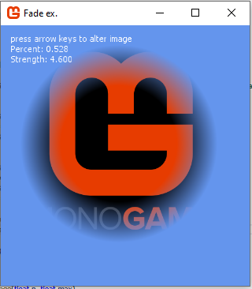

# ShaderExamples

For the MonoGame Framework ... https://www.monogame.net/
 Each game1 folder here is nearly stand alone, It has a shader that goes with it and some images.

To run the one you want to look at, from the project itself.
Edit the program.cs

Comment in the game1_xxx example you want to see execute and comment out the others.

_______

_______

Additionally you can look to this reference post on the monogame community site for reference to shader tutorials and such for monogame.

https://community.monogame.net/t/shader-examples-code-links-reference/14527

